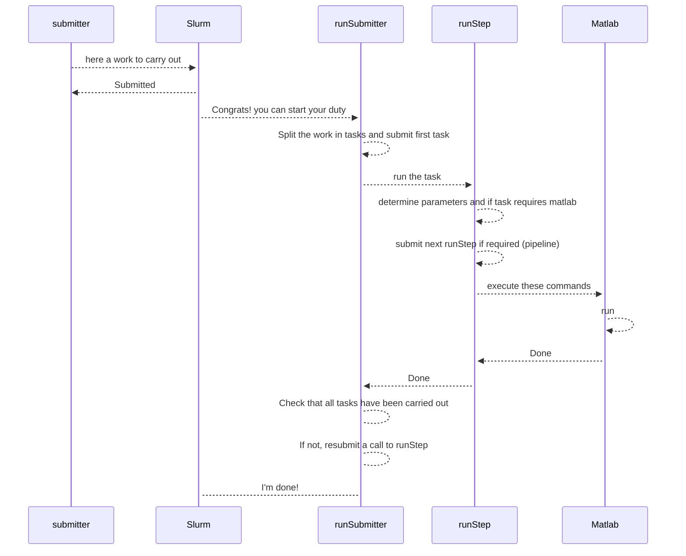

# Code organization.

This page gives information about the organization of the code of the project.

The code has been developed within what I called the snow-today application and uses a number of scripts, classes, and configuration files common with other projects.

## Code methodological approach.

This section develops the theoretical approach that I carried out to organize the code while the section [Code directories](#code-directories) give specific indications about the location of the code and names of some specific scripts or group of scripts.

### Diversity of code files.

Initially, the code for this project v2024.1.0 was developed as a large set of matlab function scripts in a project [SPIReS](https://github.com/edwardbair/SPIRES/releases/tag/v1.3) and mainly focused on runs on a individual machine.

This project still delegates the core of spectral unmixing calculations and interpolation to that set of scripts [SPIReS](https://github.com/edwardbair/SPIRES/releases/tag/v1.3), which is handled as an external matlab package.

For albedo calculation, this project also delegates a couple of functions to another external matlab package [ParBal](https://github.com/edwardbair/ParBal).

The new code presented in this project includes:

1. **submitter**: Bash scripts that interface the submission of the near real time pipeline or the generation of historical data between the user and Slurm.

2. **runSubmitter**: bash script that divides the work submitted by a **submitter** in individual tasks, submit these tasks as jobs to Slurm, control their correct achievement and handle resubmission if possible/necessary to Slurm.

3. **runStep**: A set of bash scripts that carry out one of the specific task given by **runSubmitter**. They load/determine the configuration and give a set of instructions to Matlab to carry out the task, or if implemented, carry out the task without calling Matlab. These scripts are helped by utilitary scripts **tool** that cover the work common to all steps.

4. **Matlab**: 
    1. Matlab function scripts that were derived from this initial code to handle the generation of both the near real time and historical data in a uniform way.

    2. Matlab tool classes that allow to handle:
      - data writing/reading, including configuration files and ancillary data, file naming, satellite sensor parametering
      - some functionalities more specific to SPIReS, but shared among versions of SPIReS: import of nasa products, generation of raster netcdf/geotiff, statistic calculations, export to snow-today webapp	

### Code interactions within a submission to Slurm.

The code bricks presented [above](#diversity-of-code-files) interact this way when a user execute a **submitter** bash script in a login session:

### Ancillary data.

[TO FILL]

## Code directories.

### Within repository.

#### doc.

This directory contains the documentation of the project (in `doc/user_guide`), written in Markdown. Some of this documentation is a copy of documentation for other projects that are developed within the snow-today application.

#### env.

Contains the project configuration file .matlabEnvironmentVariablesv202410.

#### external.

This directory contains code of Inpaint_nans external package, used to spatially fill the gaps in the input product (mod09ga).

#### home.

Contains environment variable and alias files that should be positionned in the home directory of the user, for Linux. A version for Windows is not available.

#### scripts.

Contains all the bash scripts which handle the submission and monitoring of slurm jobs for the daily generation with the near real time pipeline or the generation of historics.

In particular:
- `configuration.sh`, specific to this project, which set parameters for the near real time pipeline.
- the `tools*.sh` series + runSubmitter.sh, shared with other projects, which handle the submission and monitoring of slurm jobs. In addition, runRsync.sh is used to sync files scratch to archive and vice-versa. All these files **must not** be updated without coordination with other projects.
- the `run*.sh` scripts, which handle the specificities of each step of the nrt pipeline or the generation of historics. Most scripts are shared with other versions of SPIReS (and so these files **must not** be updated without coordination with other SPIReS versions), to the exception of: runSpiresFill.sh, runSpiresSmooth.sh, runUpdateMosaicBigRegion.sh, runUpdateWaterYearSCD.sh.

Referring to the [code methodological approach](#approach-diversity-of-code-files), the scripts:
- **submitter** are `scripts/submitSpiresV202410ForNrt.sh` and `scripts/submitSpiresV202410ForHistorics.sh`,
- **runSubmitter** is `scripts/runSubmitter.sh`,
- **runStep** are the remaining scripts starting by `run`, e.g. `scripts/runGetMod09gaFiles.sh`. The list of runStep scripts is given in `scripts/configuration.sh`.
- **tool** are the scripts starting by `tools`, e.g. `scripts/toolsStart.sh`.

#### tbx/ESPToolbox.

Contains .m script files which do the actual calculations for SPIReS core and peripheral steps. Some are classes. Others are function files carrying out utilities.

*Warning*
For this version of SPIReS, many function scripts are not physically in this repository but are in https://github.com/edwardbair/SPIRES repository, [cloned locally](install_spires_v202410.md) and used by the scripts of this project.

#### tbx/colormaps.

Legacy colormaps. Might be removed from this repository.

#### tbx/conf.

Contains .csv configuration files, that are loaded as tables with the ESPEnv.m and Regions.m scripts. Allows to configure the file patterns, the step parameters (called here filters), the versions, the region parameters, the land subdivisions, the variables, etc.

**Advanced use**
If the step filters are updated (for instance setting up a threshold of minimal snow detection of 15% rather than 10%), it is advised to have a distinct, new version number for the output spires data after editing of this configuration.

#### tbx/mapping.

Legacy matlab struct files used for reprojection. Might be removed from this repository.

#### tbx/template.

Contains the .cdl templates of the [output netcdf](output_netcdf_v202410.md).

#### updates.

Scripts to generate regions. Might be removed from this repository.

### Outside repository, ancillary data.

[TO FILL]