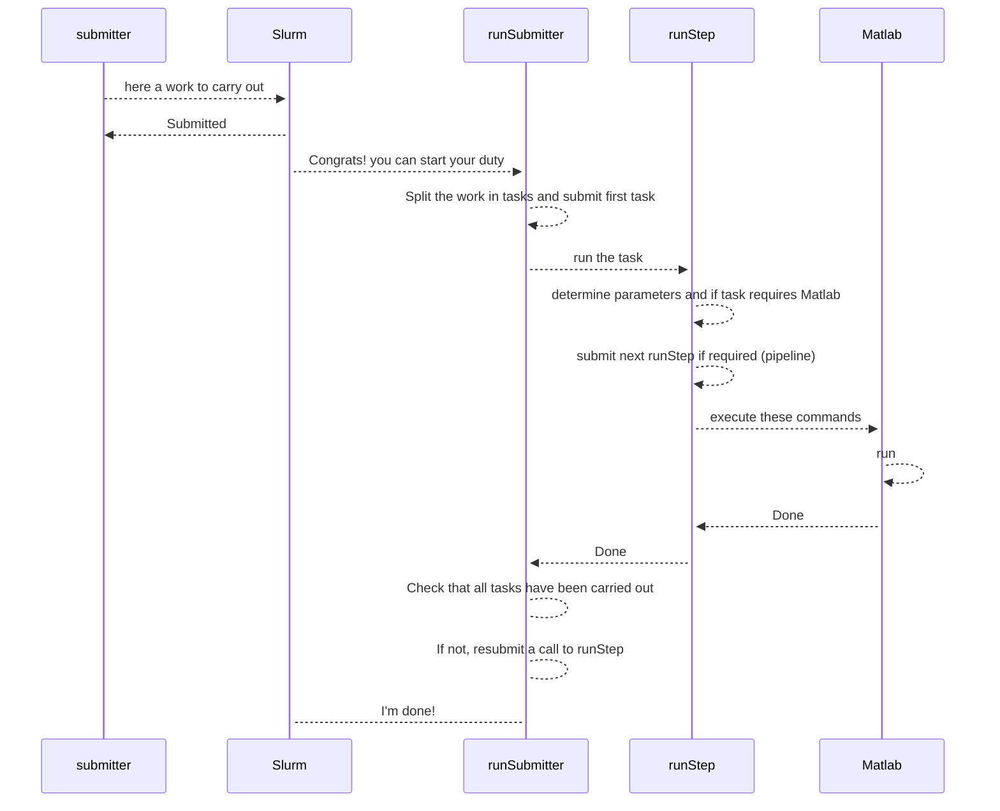

# Code organization.

This page gives information about the organization of the code of the project.

The code has been developed within what I called the snow-today application and uses a number of scripts, classes, and configuration files common with other projects.

## Code methodological approach.

This section develops the theoretical approach that I carried out to organize the code, while the section [Code directories](#code-directories) gives specific indications about the location of the code and names of some specific scripts or groups of scripts.

### Diversity of code files.

Initially, the code for SPIReS v2024.1.0 was developed as a large set of MATLAB function scripts in a project called [SPIReS](https://github.com/edwardbair/SPIRES/releases/tag/v1.3) and mainly focused on runs on an individual machine.

This project still delegates the core of spectral unmixing calculations and interpolation to that set of scripts, [SPIReS](https://github.com/edwardbair/SPIRES/releases/tag/v1.3), which is handled as an external MATLAB package.

For albedo calculation, this project also delegates a couple of functions to another external MATLAB package [ParBal](https://github.com/edwardbair/ParBal).

The new code presented in this project includes:

1. **submitter**: Bash scripts that interface the submission of the near real-time pipeline or the generation of historical data between the user and Slurm.

2. **runSubmitter**: Bash script that divides the work submitted by a **submitter** into individual tasks, submits these tasks as jobs to Slurm, controls their correct achievement, and handles resubmission if possible/necessary to Slurm.

3. **runStep**: A set of Bash scripts that carry out one of the specific tasks given by **runSubmitter**. They load/determine the configuration and give a set of instructions to MATLAB to carry out the task, or if implemented, carry out the task without calling MATLAB. These scripts are helped by utility scripts **tool** that cover the work common to all steps.

4. **Matlab**: 
    1. MATLAB function scripts that were derived from this initial code to handle the generation of both the near real-time and historical data in a uniform way.

    2. MATLAB tool classes that allow handling:
      - data writing/reading, including configuration files and ancillary data, file naming (class `ESPEnv`, would be better renamed `DataManager`), satellite sensor parametering (class `MODISData`, would be better renamed `SensorManager`), and tile and raster handling (class `Regions`),
      - some functionalities that are more specific to SPIReS but shared among versions of SPIReS: import of NASA products, generation of raster NetCDF/GeoTIFF, statistic calculations, and export to the Snow-Today web app.

### Code interactions within a submission to Slurm.

The code bricks presented [above](#diversity-of-code-files) interact this way when a user execute a **submitter** Bash script in a login session:

An extensive set of environmental variables (around 50 for SPIReS v2024.1.0) is defined in the project. Most are only used by the Bash scripts, but a small amount is also used in the MATLAB scripts and facilitates the communication between the Bash scripts and the MATLAB scripts.

## Code directories.

### Within repository.

With the exception of the files in `env/` and `home/` (see [install](install.md)), or only for advanced use, not for production of data, files within this project repository should not be edited.

#### bash/ and bashSpiresV202410/.

Contains all the Bash scripts that handle the submission and monitoring of Slurm jobs for the daily generation with the near real-time pipeline or the generation of historics.

In particular:
- `configuration.sh`, specific to this project, which set parameters for the near real-time pipeline.
- the `tools*.sh` series + runSubmitter.sh, shared with other projects, which handle the submission and monitoring of Slurm jobs. In addition, runRsync.sh is used to sync files from scratch to archive and vice versa. All these files **must not** be updated without coordination with other projects.
- the `run*.sh` scripts, which handle the specificities of each step of the NRT pipeline or the generation of historics. Most scripts are shared with other versions of SPIReS (and so these files **must not** be updated without coordination with other SPIReS versions), with the exception of `runSpiresFill.sh`, `runSpiresSmooth.sh`, `runUpdateMosaicBigRegion.sh`, and `runUpdateWaterYearSCD.sh`.

Referring to the [code methodological approach](#diversity-of-code-files), the scripts:
- **submitter** are `bash/submitNrt.sh` and `bash/submitHistoric.sh`,
- **runSubmitter** is `bash/runSubmitter.sh`,
- **runStep** are the remaining scripts starting by `run`, for example, `bash/runGetMod09gaFiles.sh`. The list of runStep scripts is given in `bash/configurationSpiresV202410.sh`. Scripts specific to SPIReS v2024.1.0 are in `bashSpiresV202410`.
- **tool** are the scripts starting with `tools`, for example, `bash/toolsStart.sh`.

#### conf/.

Contains .csv configuration files that are loaded as tables with the `ESPEnv.m` and `Regions.m` scripts. Allows the advanced user to configure the file patterns, the step parameters (called here filters), the versions, the region parameters, the land subdivisions, the variables, etc.

Most configuration is generic. Configuration files specific to SPIReS v2024.1.0 exist, for instance `configuration_of_versionsvariablesSpiresV202410.csv`, and are named based on the initial file default to Snow-Today, `[previous_name_without_extension]SpiresV202410[extension]`.

Editing of these configuration files is not recommended for data production and is reserved for advanced use.

#### doc/.

This directory contains the documentation of the project (in `doc/user_guideSpiresV202410/`), written in Markdown. Some of this documentation is a copy of documentation for other projects that are developed within the Snow-Today application.

#### env/.

Contains the project configuration file `.matlabEnvironmentVariablesSpiresV202410`. This file should be edited for [installation](install.md).

#### external/.

This directory contains the code of the Inpaint_nans external package, used to spatially fill the gaps in the input product (mod09ga).

#### home/.

Contains environment variable and alias files that should be positioned (and edited, see [installation](install.md)) in the home directory of the user, for Linux. A version for Windows is not available.

#### matlab/ and matlabSpiresV202410/.

Contains .m script files, which do the actual calculations for SPIReS core and peripheral steps. Some are classes. Others are function files carrying out utilities. Scripts specific to SPIReS v2024.1.0 are in `matlabSpiresV202410/`.

*Warning*
For this version of SPIReS, many function scripts are not physically in this repository but are in the https://github.com/edwardbair/SPIRES repository, [cloned locally](install.md) and used by the scripts of this project.

#### template/.

Contains the .cdl templates of the [output NetCDF](output_netcdf.md).

### Outside repository, ancillary data.

#### Ancillary data.

Information is [here](install.md#ancillary-data).

## Appendices.

### List of configuration files.

| label | type | description | relative file path after installation |
|---|---|---|---|
| bashrc | linux + bash environment | Linux user-specific configuration script that runs automatically every time the user opens a Linux session. Defines and exports variables, and also Linux alias.  CU Users only needs to update their Earthdata token `nrt3ModapsEosdisNasaGovToken` and, for users running the NRT pipeline, the location (`espWebExportSshKeyFilePath`) of their rsa authentication key to the wep-app Snow-Today server in this file. | ~/.bashrc |
|---|---|---|---|
| netrc | linux + bash environment | Linux user-specific file storing credentials to access remote servers. 
In this project, used at step `mod09ga`. | ~/.netrc |
|---|---|---|---|
| id_rsa | linux environment | Linux user-specific private and public key files to automatic authentication to remote servers. storing credentials to access remote servers.  In this project, used at step `webExpSn`. | ~/.ssh/id_rsa_nusnow |
|---|---|---|---|
| matlabConf | bash environment | User-specific configuration script that contains all paths to matlab code necessary for the project.  During installation, the user should edit the part entitled `# To edit to your configuration.`   In particular, the variable `thisEspProjectDir` should be set to the path of the user's local repository, and the paths of external packages adapted to the paths the user decided for installation. | `env/.matlabEnvironmentVariablesSpiresV202501` |
|---|---|---|---|
| bashConf | bash environment | Configuration of the NRT pipeline steps, with slurm configuration + general bash configuration. Used for NRT pipeline + historicals. | `bash/configurationSpiresV202501.sh` |
|---|---|---|---|
| bashConfHist | bash environment | Configuration of the historic steps, with slurm configuration. Used for historicals. | `bash/configurationForHistoricsSpiresV202501.sh` |
|---|---|---|---|
| fileConf | matlab environment | File path patterns associated with all dataLabels, which identify the type of data or ancillary data. Also includes information on date format within the file, and file names given during export to the web-app, step `webExpSn`.   Currently, this conf file is not used by the bash scripts, which, when necessary at steps `mod09ga` and `ftpExpor`, hard code the file paths. | `conf/configuration_of_filepaths.csv` |
|---|---|---|---|
| regionConf | bash + matlab environment | Definition of regions, for tiles and big regions, including their `objectId` (column `id`), the version of their ancillary data (column `versionOfAncillary`), and, for tiles, the big region they belong to (column `bigRegionId`).   This conf is called by the bash scripts using `awk` function and the column order **MUST NEVER** be changed in this file. | `conf/configuration_of_regions.csv` |
|---|---|---|---|
| subdivisionConf | matlab environment | Definition of the land subdivisions, that is the territories used to calculate statistics and to focus on snow patterns in the images displayed on the Snow-Today website. Configuration used in the step `daStatis`, `daGeoBig`, and `webExpSn` | `conf/configuration_of_landsubdivisions.csv` |
|---|---|---|---|
| varVersionConf | matlab environment | Definition of input/ouput for variables depending the input and ouput DataLabel, with formats, size, names in files. | `conf/configuration_of_versionsvariablesSpiresV202501.csv` |
|---|---|---|---|

The list is not exhaustive, with ~10 configuration files to document in addition.
 
In this list, only bashrc and netrc are located in the user's Linux home directory and automatically accessible during a session; the rest of the files are located in the user's local repository (relative path is indicated based on the root directory of this repository), and are loaded by the code of the project.

Types of configuration files:
- Linux: the lowest level of configuration, which is automatically loads when the user starts a session.
- Bash: Bash scripts of this project use this configuration.
- Matlab: Matlab scripts of this project use this configuration.
